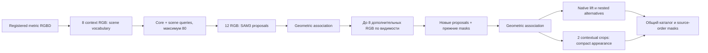

# Ограниченный quality-профиль FARM

`quality scene-profile plan` собирает существующие проверенные этапы в обычный
FARM DAG. Его выполняет `farm run`: snapshot исходников, отдельные журналы,
статусы этапов и время остаются в стандартном orchestrator.

Это development-профиль для **уже подготовленного зарегистрированного RGBD** из
3DGS+COLMAP. Исходный FARM ingress отвечает за масштаб, gravity и RGB↔GS
регистрацию. Профиль не объявляет unregistered depth метрическим наблюдением.
Обработка исходных PLY/COLMAP/RGB и время ingress пока считаются отдельно.



## Запуск

В inference-контейнере с FARM source:

```bash
python -m farm_runtime.cli quality scene-profile plan \
  --scene-id my_scene \
  --rgbd /absolute/registered_rgbd \
  --ply /absolute/scene.ply \
  --sam-model /absolute/sam3_checkpoint \
  --vlm-model /absolute/qwen3_vl_4b_checkpoint \
  --world-up 0 -1 0 \
  --project-root /absolute/FARM-Project \
  --output-root /absolute/quality_outputs \
  --runtimes /absolute/runtime_prefixes.json \
  --output /absolute/quality_pipeline.json
```

`world-up` должен быть получен из конкретной сцены; пример оси не универсален.
`runtime_prefixes.json` содержит ровно `main` и `geometry`: каждый — список
аргументов команды, запускающей Python. Для раздельных Docker-образов это
`docker run ... --entrypoint /path/to/python IMAGE`, для единого подготовленного
контейнера — путь Python. Shell interpolation не используется. Пути входов,
outputs и `${execution_project_root}` должны быть доступны в обоих runtime;
последний — snapshot, созданный существующим orchestrator. Runtime pins и
mounts задаются конфигурацией установки, а не названиями Factory/Knaack.

На документированном FARM control plane:

```bash
farm validate-plan --config /absolute/quality_pipeline.json
farm run --config /absolute/quality_pipeline.json --run-id quality-v1
farm status --run /absolute/quality_outputs/my_scene/runs/quality-v1
```

GPU inference выполняется в контейнерах. Host control plane и его подготовка
описаны в [DEPLOYMENT.md](DEPLOYMENT.md). Если `--runtimes` пропущен, команды
используют Python текущего orchestrator; это пригодно только для контейнера,
в котором доступны обе группы зависимостей.

## Бюджеты и смысл результата

По умолчанию 12 первоначальных + до 8 дополнительных сегментируемых RGB,
8 context RGB для словаря, до 128 native candidates, до 64 appearance
candidates × 2 timestamps, до 16 nested alternatives. При превышении
object-бюджета порядок задаётся числом независимых timestamps и стабильным ID;
необработанные IDs явно перечислены. Это ограничивает работу, но не доказывает
полноту сцены. Если новых полезных видов нет, SAM3 повторно не загружается.
Отсутствие multi-timestamp groups останавливает native stage с явной причиной.

Native profile использует `configs/quality/native_rendered_v1.json`: валидная
rendered contribution, отрицательное свидетельство конкретного кандидата,
сохранение transient/depth unknown. Выполняется только `exclusions_on`;
`native-observations --mode both` сохраняет прежний режим ablation.
Калиброванного release этот конфиг не заявляет.

Выход `quality/catalog/catalog.json` связывает:

- `object_masks.npz`: exclusive primary membership исходных строк PLY;
- `scope_alternatives/*.npz`: отдельные пересекающиеся варианты physical scope;
- observed OBB и tail-sensitivity, независимые timestamps;
- `label`/`caption` как **unverified model proposals**, с исходными canvases;
- SHA256 namespace геометрии, исходный PLY, его масштаб, причины неопределённости
  и отложенные IDs.

`physical_dimensions_m=null` не скрывает оценку observed geometry: она доступна
в `observed_obb.dimensions_m`. Это разные утверждения. Глубина за прозрачным
окном и скрытая толщина панели не становятся физическим измерением объекта.
Маски альтернатив не объединяются молча в exclusive bank.

Targeted crop refinement из этапа V12/11 и автоматическое разрешение scope
ещё не включены в этот общий профиль. Они требуют отдельного выбора кандидатов
по противоречиям. Новый каталог не заменяет проверенный production bank и не
означает завершённый universal quality release.
